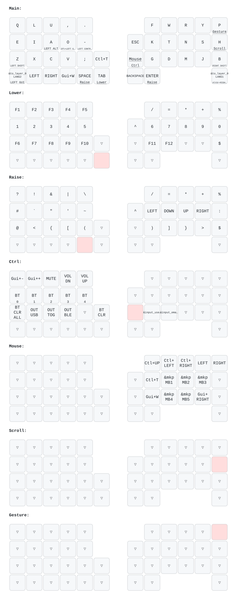

# zmk-config-moNa2-v2

moNa2 v2とCOROPIT向けの個人用ZMK設定です。

日本語入力には[大西配列](https://o24.works/layout/)を使用しています。大西配列はローマ字100万字の統計を基に設計されたキー配列です。母音と子音を左右へ分けることで両手の交互打鍵を増やし、指の移動と同じ指の連続使用を抑えています。

## 主な機能

- 大西配列をベースにした42キー向けkeymap
- Home Row ModsとSandS
- 左右どちらの手でも使えるMouse layer
- 左手親指キーtapによるMouse layer切り替え
- `H`holdによるTrackball scroll
- `P`holdによるTrackball gesture
- ZMK Studio対応
- USBとBluetooth出力の切り替え
- COROPIT向けTrackball軸反転

## Trackball操作

### Mouse layer

左手親指キーをtapするとMouse layerが有効になります。Mouse layerでは左右どちらの手でもmouse buttonを操作できます。

| キー | 動作 |
| --- | --- |
| `I` / `S` | Middle click |
| `O` / `T` | Left click |
| `A` / `N` | Right click |
| `X` / `J` | Button 5 |
| `V` / `D` | Button 4 |

### Scroll

`H`をholdしながらTrackballを動かすとscrollします。`H`をtapした場合は通常の`H`が入力されます。

### Gesture

`P`をholdしながらTrackballを動かすとbrowser tabを操作します。`P`をtapした場合は通常の`P`が入力されます。

| Trackball方向 | 動作 | Shortcut |
| --- | --- | --- |
| 左 | 前のtab | `Ctrl+Shift+Tab` |
| 右 | 次のtab | `Ctrl+Tab` |
| 上 | 新規tab | `GUI+T` |
| 下 | tabを閉じる | `GUI+W` |

## Layer構成

| Layer | 用途 | 起動方法 |
| --- | --- | --- |
| Main | 大西配列 | Default |
| Lower | Function keyと数字 | `Tab`hold |
| Raise | 記号とcursor | `Space`holdまたは`Enter`hold |
| Ctrl | Bluetoothと出力設定 | 左手親指キーhold |
| Mouse | Mouse button | 左手親指キーtap |
| Scroll | Trackball scroll | `H`hold |
| Gesture | Browser tab操作 | `P`hold |

## COROPIT設定

右側TrackballはCOROPIT向けにX軸を反転しています。

滑らかさを優先してPMW3610を次の設定で動作させています。

- CPI: `3200`
- Cursor scaling: `1/3`
- Sampling interval: `4ms`
- Report interval limit: `0ms`
- Bluetooth connection interval: `7.5ms`

省電力設定より電池消費が増える点に注意してください。

## Build

`main`へのpushでGitHub Actionsが左右のfirmwareとsettings reset firmwareをbuildします。生成されたfirmwareは[Actions](https://github.com/r1cA18/zmk-config-moNa2-v2/actions)から取得できます。

## Firmware書き込み

### 通常の更新

1. Actionsで最新の成功した`Build`workflowを開きます。
2. `Artifacts`から`firmware`をdownloadして展開します。
3. 左側をUSB接続してreset buttonを素早く2回押します。
4. USB driveとして認識されたcontrollerへ`mona2_l rgbled_adapter-seeeduino_xiao_ble-zmk.uf2`をcopyします。
5. 右側も同じ手順で`mona2_r rgbled_adapter-seeeduino_xiao_ble-zmk.uf2`をcopyします。
6. 左側をUSB接続してkey入力とTrackball操作を確認します。

UF2のcopy後はUSB driveが自動的にunmountされてcontrollerが再起動します。OSがcopy errorを表示しても書き込み済みの場合があるため、再起動後の動作で判断します。

### Bluetooth接続を初期化する場合

左右が接続できない場合やpairing情報を消したい場合だけ`settings_reset-seeeduino_xiao_ble-zmk.uf2`を使用します。

1. 左右それぞれへ`settings_reset-seeeduino_xiao_ble-zmk.uf2`を書き込みます。
2. 左側へ通常の左用UF2を書き込みます。
3. 右側へ通常の右用UF2を書き込みます。
4. PCやmobile device側の古いBluetooth登録を削除します。
5. moNa2を再度pairingします。

`settings_reset`はBluetooth profileや出力設定などの保存済み設定を消去します。通常のkeymap更新では使用しません。

## 参考

- [大西配列](https://o24.works/layout/)
- [moNa2 v2](https://github.com/Arai-yt/zmk-config-moNa2-v2)
- [ZMK Firmware](https://zmk.dev/)
